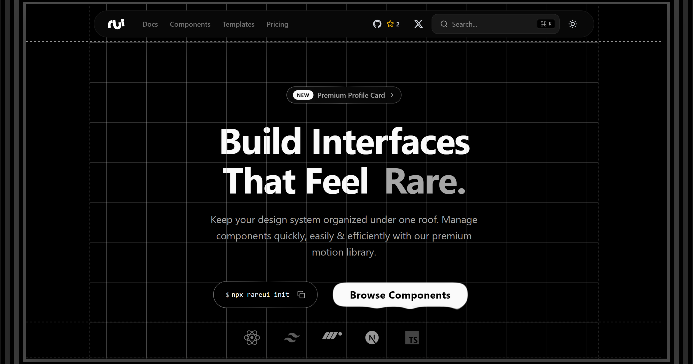

<div align="center">
  <br>
  <br>
  
  <br>
  <br>
</div>

<br />

<div align="center">
    <picture>
      <source media="(prefers-color-scheme: light)" srcset="public/og-imagewhite.png">
      <source media="(prefers-color-scheme: dark)" srcset="public/og-imageblack.png">
      
    </picture>
</div>

<br />

<div align="center">
  The most unique & premium library of animated React components.
</div>

<br />

<div align="center">
  <a href="https://github.com/Codewithswappy/RareUI/stargazers"></a>
  <a href="https://github.com/Codewithswappy/RareUI/blob/main/LICENSE"></a>
  <a href="https://x.com/heyyswap"></a>
</div>

## Documentation

Go to [rareui.in](https://rareui.in/) to view the documentation.

## About

RareUI is a collection of premium, high-quality, and animated React components, made to help you stand out through your web creations. It is designed to be copy-pasted into your apps, fully customizable, and open source.

## Key Features

- **Premium Design**: Meticulously crafted components with a focus on aesthetics and user experience.
- **Copy-Paste or CLI**: Install via CLI or just copy the code you need.
- **Dark Mode Support**: First-class support for light and dark modes out of the box.
- **Fully Customizable**: Built on top of Tailwind CSS for easy styling and theming.
- **Production Ready**: Typed with TypeScript and rigorously tested.
- **Tech Stack**: React 19, Next.js 16, Tailwind CSS 4, Framer Motion 12.

## Installing Components Via CLI

RareUI supports a CLI for quick installs. <br/>
Each component can be installed with a simple command:

```bash
# Install a single component
npx rareui add [component-name]

# Example
npx rareui add liquid-metal
```

Detailed instructions can also be found [here](https://rareui.in/docs/installation/cli).

## How To Contribute?

Contributions are welcome! Check the [Open Issues](https://github.com/Codewithswappy/RareUI/issues) to see how you can help. <br/>
Please review the [Contributing Guide](CONTRIBUTING.md) and follow our standards. Thanks for your time!


## Author

[Swappy](https://x.com/heyyswap)

## License

Licensed under the [MIT license](LICENSE).
